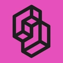

<div align="center">


### The Apple docs MCP your AI actually deserves.

*Apple docs. WWDC26 transcripts. RAG retrieval + [Jev](https://typesafe.ai/) relevance ranking. One clean tool.*

<a href="https://apple-rag.com"></a>

[](https://cursor.com/en/install-mcp?name=apple-rag-mcp&config=eyJ1cmwiOiJodHRwczovL21jcC5hcHBsZS1yYWcuY29tIn0%3D)

[](vscode:mcp/install?%7B%22name%22%3A%22apple-rag-mcp%22%2C%22type%22%3A%22http%22%2C%22url%22%3A%22https%3A%2F%2Fmcp.apple-rag.com%22%7D) [](vscode-insiders:mcp/install?%7B%22name%22%3A%22apple-rag-mcp%22%2C%22type%22%3A%22http%22%2C%22url%22%3A%22https%3A%2F%2Fmcp.apple-rag.com%22%7D)

[🌐 Website](https://apple-rag.com) • [📊 Dashboard](https://apple-rag.com/overview)

[](https://github.com/BingoWon/apple-rag-mcp/actions/workflows/ci.yml) [](LICENSE)

**English** | [中文](./README.zh-CN.md)

</div>

---

## Not Just Another Docs Tool

Hybrid retrieval combines keyword and semantic search to find Apple sources. [Jev](https://typesafe.ai/) then ranks the merged candidates for relevance to your question, bringing the best matches to your agent.

**Minimal footprint. Maximum signal.** Our MCP tools are designed to be lean—no bloated responses, no wasted tokens, no noise cluttering your agent's context. Just the information that matters.

### Powered by [ Jev](https://typesafe.ai/)

[Jev](https://typesafe.ai/), a decision model, scores candidate Apple documentation
and video transcripts against each query's API, platform, and version requirements.
We use its relevance scores to rank the sources returned through MCP. A backup
reranker takes over if the API call fails.

---

## Open Source. Ready to Use.

The [hosted service](https://apple-rag.com/) connects your agent to an Apple knowledge base that is already collected, cleaned, and indexed.

- **Ready-to-query sources:** Official developer documentation and video transcripts, available through one connection.
- **Retrieval model calls included:** Embeddings, [Jev](https://typesafe.ai/) ranking, and the backup reranker run on our service.
- **Ongoing upkeep:** We handle content collection, index updates, database backups, and protocol compatibility.

The source is public for inspection and self-hosting. Running your own instance means operating a database, building and refreshing your corpus, and managing your model API credentials.

[Start free](https://apple-rag.com/). [Pro](https://apple-rag.com/#pricing) includes 50,000 tool calls/week and 50/minute for $1/week, shared by `search` and `fetch`.

---

## Start in Seconds

**Configure with your agent:** In the [dashboard](https://apple-rag.com/overview),
select a token and click **Copy Install Prompt**. Paste it into your current
agent to configure the connection and verify the tools.

**One click:**

[](https://cursor.com/en/install-mcp?name=apple-rag-mcp&config=eyJ1cmwiOiJodHRwczovL21jcC5hcHBsZS1yYWcuY29tIn0%3D)

[](vscode:mcp/install?%7B%22name%22%3A%22apple-rag-mcp%22%2C%22type%22%3A%22http%22%2C%22url%22%3A%22https%3A%2F%2Fmcp.apple-rag.com%22%7D) [](vscode-insiders:mcp/install?%7B%22name%22%3A%22apple-rag-mcp%22%2C%22type%22%3A%22http%22%2C%22url%22%3A%22https%3A%2F%2Fmcp.apple-rag.com%22%7D)

Click a button to open your editor and confirm installation.

### Option 2: Manual Setup for Other MCP Clients

**JSON Configuration (Copy & Paste):**
This is a configuration example, not a universal client format. The dashboard
also retains manual configuration examples.

```json
{
  "mcpServers": {
    "apple-rag-mcp": {
      "type": "http",
      "url": "https://mcp.apple-rag.com"
    }
  }
}
```

**Manual Configuration Parameters:**
- **MCP Type:** `Streamable HTTP`
- **URL:** `https://mcp.apple-rag.com`
- **Protocol:** `2026-07-28`
- **Authentication:** `Optional` (MCP Token for higher limits)
- **MCP Token:** Get yours at [apple-rag.com](https://apple-rag.com) for increased quota

Client compatibility requires support for protocol `2026-07-28`; saving a
configuration alone does not verify a working connection.

> **Note:** No MCP Token required to start! You get free queries without any authentication. Add an MCP Token later for higher usage limits.

## 🌟 Why Developers Love Apple RAG MCP

<table>
<tr>
<td width="50%">

### ⚡ **Fast & Reliable**
Get quick responses with our optimized search infrastructure. No more hunting through docs.

### 🎯 **AI-Powered Hybrid Search**
Hybrid search combines keyword and semantic retrieval for Apple documentation and video transcripts. [Jev](https://typesafe.ai/) then ranks the combined candidates against your question, giving your agent more relevant context.

### 🔒 **Always Secure**
MCP authentication ensures trusted access for your AI agents with enterprise-grade security.

</td>
<td width="50%">

### 📝 **Code Examples**
Get practical code examples in Swift, Objective-C, and SwiftUI alongside documentation references.

### 🔄 **Real-time Updates**
Our documentation index is continuously updated for WWDC26, Xcode 27 beta, and the latest Apple developer resources.

### 🆓 **Start Free**
Try without an account: 30 tool calls/week and 3/minute. Register at [apple-rag.com](https://apple-rag.com/) for 50/week and 5/minute, shared by `search` and `fetch`.

</td>
</tr>
</table>

## 🎯 Features

- **🔍 Semantic Search** - Vector similarity with semantic understanding for intelligent retrieval
- **🔎 Keyword Search** - Precise technical term matching for API names and specific terminology
- **🎯 Hybrid Search** - Combines keyword and semantic retrieval
- **📚 Complete Coverage** - iOS 27, iPadOS 27, macOS 27, watchOS 27, tvOS 27, and visionOS 27 documentation
- **🎬 WWDC26 Videos** - Full transcripts from Apple Developer videos and WWDC26 sessions
- **⚡ Fast Response** - Optimized for speed across all content types
- **🚀 High Performance** - Multi-instance cluster deployment for maximum throughput
- **🔄 Always Current** - Synced with Apple's latest docs, WWDC26 sessions, and Xcode 27 beta references
- **🛡️ Secure & Private** - Your queries stay private
- **🌐 MCP 2026 Native** - Stateless MCP `2026-07-28`

## 📄 License

This project is licensed under the [MIT License](LICENSE).

<div align="center">

---

**Better docs. Better context. Better code.**

[Get Started →](https://apple-rag.com)

</div>
